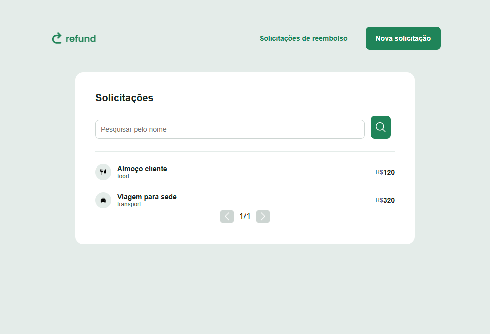
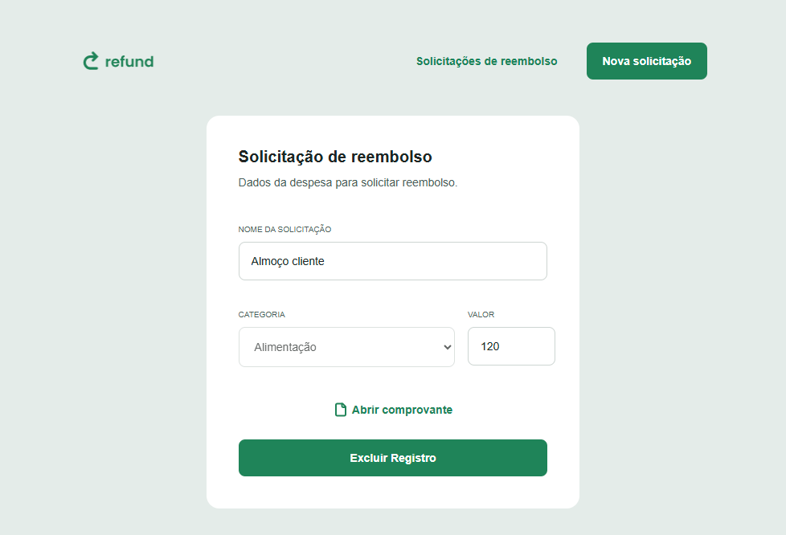
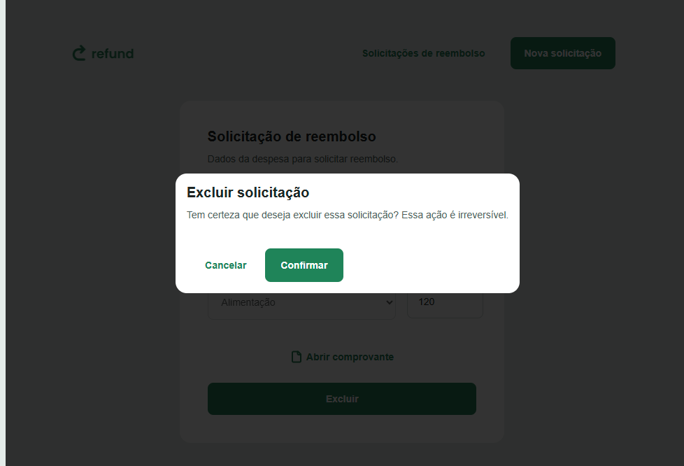
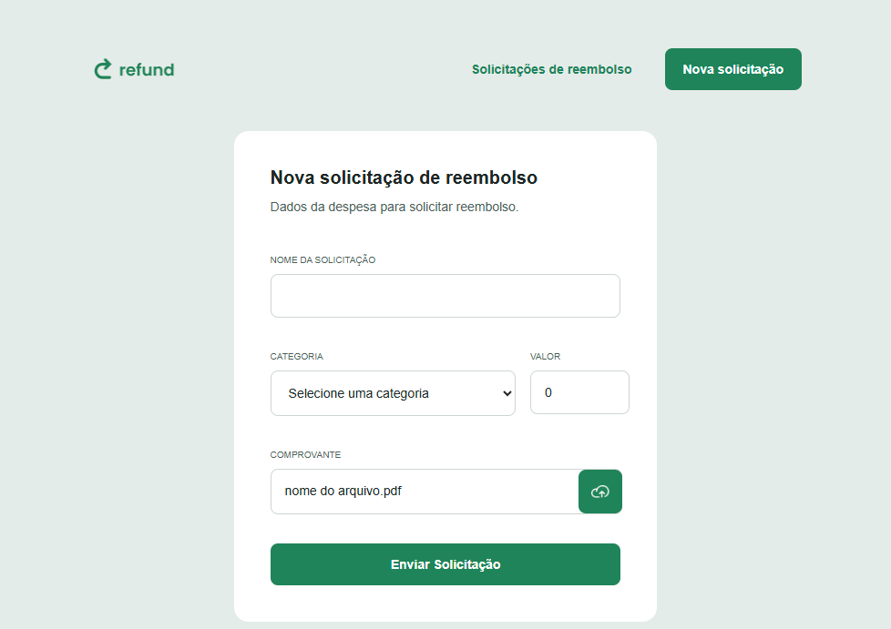
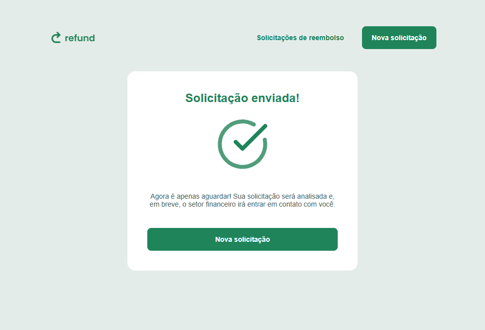

# Desafio React - Simulador de reembolso

Este é um projeto desenvolvido como parte do desafio para praticar **React** e integração com API.

## Design

O layout utilizado para o desenvolvimento pode ser acessado no Figma:

🔗 [Link do Figma](https://www.figma.com/design/UYVZiIReJjG3vcDOR7PePK/Sistema-de-reembolso--Community---Copy-?node-id=3-376&p=f&t=AhF8OCyAQq4EZ7cD-0)

## API

A Api utilizada para desenvolvimento pode ser acessada pelo Link: 

🔗 [Link API Refund](https://github.com/rocketseat-education/refund-api)

## Layouts
Lista de Reembolsos

Detalhe de Reembolso

Confirmação de exclusão

  

Novo reembolso

Solicitação enviada

